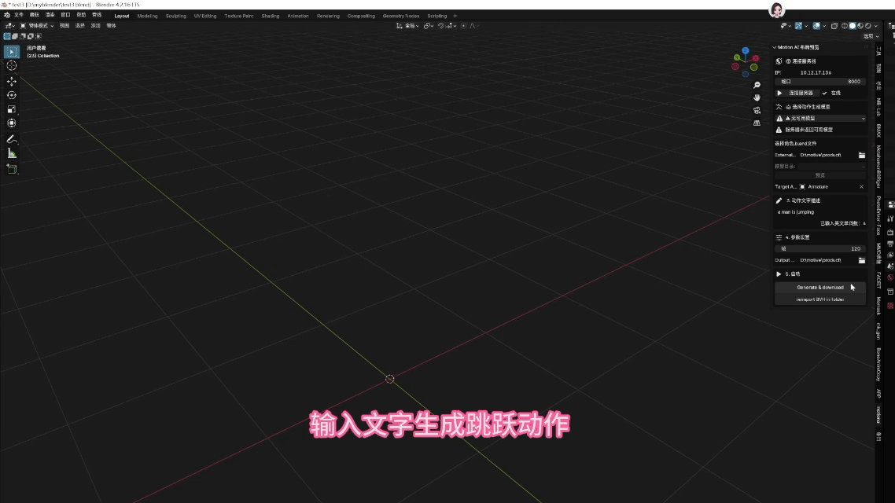

---
hide:
  - navigation
  - toc
title: 元宇宙联合创新实验室
---

元宇宙联合创新实验室

香港科技大学（广州）

DIGITAL HUMAN  ·  VIRTUAL REALITY  ·  METAVERSE  ·  AI

[SceneForge 场景生成 :octicons-arrow-right-24:](sceneForge/index.md){ .md-button }
[DeepOwl 动作生成 :octicons-arrow-right-24:](momask_ai/index.md){ .md-button }

---

<h2 class="section-title">我们的产品</h2>

### :material-cube-outline: SceneForge 场景生成

面向 Unity 的 3D 室内场景智能生成平台。输入自然语言描述，一键生成具备物理属性与光影效果的复杂 3D 室内场景。

[:octicons-arrow-right-24: 了解更多](sceneForge/index.md){ .card-link }

### :material-run: DeepOwl AI 动作生成

基于 Blender 的文本驱动 3D 角色动作生成系统。集成 MoMask 深度学习模型，从文字描述自动生成高质量角色动画。

[:octicons-arrow-right-24: 了解更多](momask_ai/index.md){ .card-link }

---

<h2 class="section-title">核心亮点</h2>

=== ":material-cube-outline: SceneForge 场景生成"

    <figure class="showcase-figure">
      
      <figcaption>从提示词到完整 3D 场景的一键式转化</figcaption>
    </figure>

    - :material-lightning-bolt:**自然语言驱动** — 输入"一间带落地窗的北欧风格卧室"，自动生成完整室内场景
    - :material-database-sync: **双轨制资产管线** — 本地 AI2-THOR 预置库 + 云端 Objathor 海量资产库
    - :material-timer-sync: **非阻塞异步生成** — 生成过程不卡顿 Unity 主线程，实时监控任务进度
    - :material-axis-arrow: **物理落地对齐** — 自动赋予 Collider、射线吸附，场景"即开即用"
    - :material-package-variant-closed: **一键部署** — Unity 插件直接导入，三步完成场景生成

    [查看完整文档 :octicons-arrow-right-24:](sceneForge/index.md){ .card-link }

=== ":material-run: DeepOwl AI 动作生成"

    <figure class="showcase-figure">
      
      <figcaption>文本驱动的高质量 3D 角色动作生成</figcaption>
    </figure>

    - :material-text-recognition:**文本到动作** — 输入"一个人向前走然后跳起来"，自动生成对应骨骼动画
    - :material-brain: **MoMask 深度学习** — 基于掩码建模的离散动作生成，支持多种动作风格
    - :material-blender: **Blender 原生集成** — 作为 Blender 插件运行，无缝融入 3D 创作工作流
    - :material-file-code: **BVH 格式支持** — 支持 BVH 动作文件的导入、导出与转换
    - :material-sync: **热加载机制** — 支持运行时模块热更新，加速开发迭代

    [查看完整文档 :octicons-arrow-right-24:](momask_ai/index.md){ .card-link }

---

<h2 class="section-title">应用场景</h2>

:material-robot-industrial:

**具身智能训练**

为机器人导航、抓取等算法提供海量多样化 3D 训练场景

:material-hospital-building:

**医疗 / 工业仿真**

快速搭建模拟环境，结合物理引擎进行交互训练

:material-school:

**教育科研**

生成标准化场景与角色动画，便于学术可复现

:material-video-3d:

**数字内容创作**

提示词快速生成室内原型与角色动作，缩短开发周期

---

## :material-github: 开源与社区

本实验室所有项目均开源，欢迎贡献代码与提出建议。

[访问 GitHub :octicons-mark-github-24:](https://github.com/Metaverse-Lab/Metaverse-Website){ .md-button }

© 2025 香港科技大学（广州）元宇宙联合创新实验室

